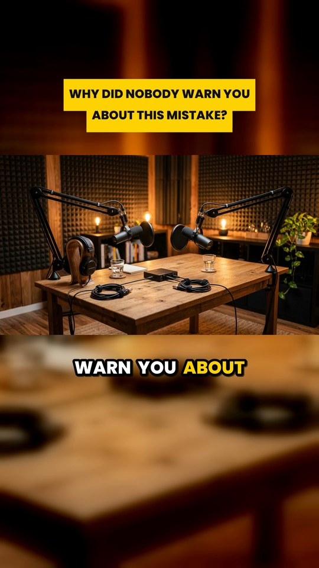

# shorts_maker

Turn a long video **you own** into captioned, vertical YouTube Shorts. It finds the strongest moments, cuts them on word boundaries, reframes to 9:16, burns in word-by-word captions and a hook banner, normalises the loudness, and writes a title and description for each Short.

It can also build a narrated horror-story Short from a few stills and a voice recording: see [story mode](#story-mode-a-narrated-captioned-short-from-stills-and-a-voice).

<p align="center">
  
</p>

> **Use it on videos you own, or have written permission or a licence to reuse.**
> Many creators forbid re-uploading their audio or animation (often stated in the video description). Doing so leads to Content ID claims and copyright strikes. If you want clips from someone else's video, ask them first.
> For Creative Commons (CC BY) material keep the attribution: `--credit` and `--source-url` put it in every description.

## Quick start

```bash
python -m venv .venv && source .venv/bin/activate     # Windows: .venv\Scripts\activate
pip install -r requirements.txt                       # ffmpeg is bundled via imageio-ffmpeg

python -m shorts_maker run my_long_video.mp4 --count 8
```

You get, for a video called `my_long_video.mp4`:

| Path | What |
|---|---|
| `output/my-long-video/short_01_*.mp4` ... | the Shorts: 1080x1920, H.264 + AAC, ready to upload |
| `output/my-long-video/shorts.md` / `shorts.json` | a title and a copy-paste description for each Short |
| `work/my-long-video/clips.json` | the moments that were picked (editable) |
| `work/my-long-video/transcript.json` | the transcript with word timings (editable) |

The first run downloads the Whisper speech model (about 480 MB for the default `small`) and transcribes on the CPU. `--model base` is 2-3x faster and a little less accurate; a CUDA GPU is used automatically when present.

## Recommended workflow: you choose, the tool does the editing

Automatic picking is a first draft. A human skim makes the difference between "fine" and "good".

```bash
python -m shorts_maker suggest my_long_video.mp4 --count 12     # writes work/my-long-video/clips.json
# open clips.json: adjust start/end, replace weak moments, rewrite the hook and title
python -m shorts_maker render  my_long_video.mp4 --source-url https://youtu.be/YOUR_VIDEO_ID
```

```json
{ "clips": [
  { "start": 312.4, "end": 358.0,
    "hook": "Nobody tells you this about starting out",
    "title": "The mistake nobody warns you about",
    "description": "optional - replaces the default description text",
    "focus": 0.35 }
] }
```

`start` / `end` are seconds in the source video; cut points are nudged so no word is chopped in half. `hook` is the banner shown for the first 3 seconds. `focus` (0 = left, 1 = right) only matters for `--layout crop`.

## What each Short looks like

* **Hook banner** at the top for the first 3 seconds, placed below YouTube's top UI band.
* **Whole frame, never cropped by accident** (`--layout blur`, default): your 16:9 video sits over a blurred copy of itself. `--layout crop` fills the screen instead and lets you pick the window with `focus`.
* **Word-by-word captions**, 3 words at a time, the spoken word highlighted, below the video and above YouTube's bottom UI band. Long words are wrapped or shrunk so nothing runs off the frame.
* **Audio normalised to -14 LUFS** (what YouTube plays back at), with short fades so cuts do not click.
* A description with a link to the full video **at that exact moment** (`--source-url`), your credit line (`--credit`) and hashtags (`--hashtags`).

YouTube currently allows Shorts up to 3 minutes. The default is 25-58 s because shorter usually holds attention better; use `--max-len 150` for longer ones.

## Common options

| Option | Meaning |
|---|---|
| `--count N`, `--min-len S`, `--max-len S` | how many Shorts to suggest and how long they may be |
| `--transcript FILE` | use an existing `.srt`, `.vtt` or `.json` instead of running Whisper |
| `--model base` / `small` / `medium` / `large-v3` | speed vs. accuracy of the transcript |
| `--language ms` | force the spoken language (default: auto-detect) |
| `--layout blur` / `crop` | how the 16:9 frame becomes 9:16 |
| `--no-captions`, `--no-hook` | turn the overlays off |
| `--words-per-caption 2`, `--no-uppercase`, `--highlight 00E5FF` | caption look |
| `--font FILE.ttf` | caption font, **required for Tamil, Chinese, Arabic and other non-Latin scripts** |
| `--source-url`, `--credit`, `--hashtags` | what goes into each description |
| `--no-audio-analysis`, `--no-loudnorm`, `--crf`, `--preset` | speed and quality knobs |

Run `python -m shorts_maker <command> --help` for everything.

## Getting your files

* **Your original video:** use the file you exported, or YouTube Studio > Content > hover the video > ⋮ > *Download*.
* **Subtitles without running Whisper:** YouTube Studio > Subtitles > your video > ⋮ > *Download* (.srt or .vtt), then pass `--transcript file.srt`. Word timing inside each subtitle line is interpolated, which is accurate enough for 2-3 word captions.

## How moments are picked

Windows between `--min-len` and `--max-len` that start and end on sentence boundaries are scored on: how hooky the opening sentence is (question, bold claim, curiosity words, not "and then we..."), emotional density, speaking pace, loudness and dynamics compared with the rest of the video, and how cleanly it ends. The best non-overlapping ones win.

Limits worth knowing:

* The word lists are English. For other languages the structural signals (questions, pace, loudness, clean endings) still work, but expect to curate more by hand.
* Captions are only as accurate as the transcript. Fix names or slang in `transcript.json`, then run `render` again.
* No face tracking and no background music. Use `--layout blur` (shows everything) or `focus` per clip.

## Tips that actually move numbers

1. The first second decides whether people swipe: open on the hook, cut any warm-up.
2. Aim for 20-45 s. End on a finished thought; an ending that flows back into the first line loops nicely.
3. Watch each Short with sound on before posting. Check names in the captions.
4. Link back to the long video (`--source-url`); that is the point of Shorts for a long-form channel.
5. Keep titles specific. The generated title is only the hook sentence: rewrite it.

## Story mode: a narrated, captioned Short from stills and a voice

Not cutting a long video but telling a story? `story` turns a handful of pictures and recorded lines into a finished Short: slow camera moves, dissolves, word-by-word captions, an original sound bed and loudness mastering. It runs offline, and the sound is synthesised from scratch, so there is no music licence to clear.

```bash
python -m shorts_maker story stories/part-1-the-door/story.json
# -> output/part-1-the-door/part-1-the-door.mp4   (1080x1920, H.264 + AAC; about 2 minutes to render)

python -m shorts_maker story stories/part-1-the-door/story.json --preview 8 --size 540x960 --preset ultrafast   # quick look
```

`stories/part-1-the-door/` is a complete example: five scenes (hallway, the door, the hand, the door ajar, the eyes), 29 seconds, with its pictures, voice clips, the finished `part-1-the-door.mp4` and `posting.md` (titles, description, hashtags, upload checklist).

You bring the pictures (any size; 9:16 fills the screen) and the voice lines (any audio format, from a text-to-speech tool or your own recording) and describe the scenes in `story.json`:

| Field | Meaning |
|---|---|
| `title`, `hook` | output file name; banner shown for the first seconds (optional) |
| `style` | caption colours as hex RGB: `highlight`, `primary`, `hook_box`, `hook_text` |
| `grain` | film grain strength, `0` for none (default 5) |
| scene `image`, `duration` | the picture, and the *minimum* seconds it stays: a scene always stretches to fit its voice |
| `lead`, `tail` | silence before the first line and after the last one (default 0.6 s) |
| `motion` | `zoom: [from, to]`, `center: [[x, y], [x, y]]` (0-1), `ease` (`smooth`, `linear`, `in`, `out`), `shake` (px), `flicker` (0-1, a failing light) |
| `transition` | `{"type": "fade", "duration": 1.4, "align": "end"}` dissolves into this scene (`align`: the dissolve starts at, is centred on, or ends at the cut); the default is a hard cut |
| `lines` | `audio`, `text`, optional `at` / `gap` (seconds), `pauses` (`{"0": 0.35}` lengthens the pause after speech chunk 0), `style` (`narrator` or `whisper`), `gain_db` |
| `sfx` | `creak`, `click`, `whoosh`, `riser`, `heartbeat`, `boom`, or `dropout` (silences the bed), each with `at` (negative = counted from the end of the scene) and `gain` (dB) |
| `tension` | 0-1: how loud the drone is in this scene |
| `end_text` | `{"text": "PART 2?", "at": 2.5, "dim": 0.5}`: a big end card, optionally dimming the picture |

How it works, so you know what to adjust:

* **Words are timed from the audio.** Pauses at commas and full stops are detected and matched to the text; inside each stretch of speech, time is shared out by word length. That is accurate enough for 2-3 word captions.
* **Voices.** The narrator gets a rumble filter, a little body and presence and light compression. A `whisper` line is turned into breath (the spectrum is kept, the phase thrown away) with a long dark reverb and a far echo; its caption is a faint ghost word.
* **Sound bed.** A slowly breathing drone whose notes sit a semitone apart, room tone, a heartbeat that speeds up, and one-shot effects, all generated with numpy. The bed ducks under the narrator, and `dropout` removes it for the silences horror needs.
* **Mastering.** The mix is measured and brought to -15 LUFS, then limited to a -2 dBFS sample peak (about -1.5 dBTP), measured again, and encoded as AAC.
* **Frame exact.** Scenes are laid on a timeline in whole frames, so cuts, captions and sound cannot drift apart (a test renders a story and checks the frame count, the cut positions and that no frame is black).

To make **Part 2**: copy the folder, swap the pictures and voice clips, edit the text and timings in `story.json`, and run the same command. Use `--no-sound-design` for narration only if you would rather add your own music.

Before you upload: listen once with headphones (the sound design is generated, so give it a real listen), and if the pictures or the voice are AI-generated and look realistic, switch on YouTube's *altered or synthetic content* disclosure. The command reminds you.

## Development

```bash
pip install -e ".[dev]"
pytest
```

The tests generate their own media with ffmpeg and cover the transcript parsers, caption timing and layout, clip selection, story planning and sound design, and real renders including pixel checks that captions are burned in and that loudness lands where it should. Whisper itself is replaced by a stand-in because the model needs a download. The only binaries in the repository are the README preview and the example story under `stories/`.

```
shorts_maker/
  cli.py          commands: transcribe, suggest, render, run, story
  transcript.py   Whisper (faster-whisper) + SRT/VTT/JSON import, word timings
  suggest.py      moment scoring, loudness analysis
  captions.py     ASS subtitles: karaoke captions + hook banner, text fitting
  render.py       cut, 9:16 reframe, burn-in, loudness, export, report
  media.py        ffmpeg discovery, probing, audio decoding
  story.py        story mode: scene planning, word timing, mixing, mastering, render
  soundscape.py   synthesised drone, heartbeat, effects, voice processing, limiter
  assets/fonts/   Poppins ExtraBold (SIL Open Font License, see OFL-Poppins.txt)
```
